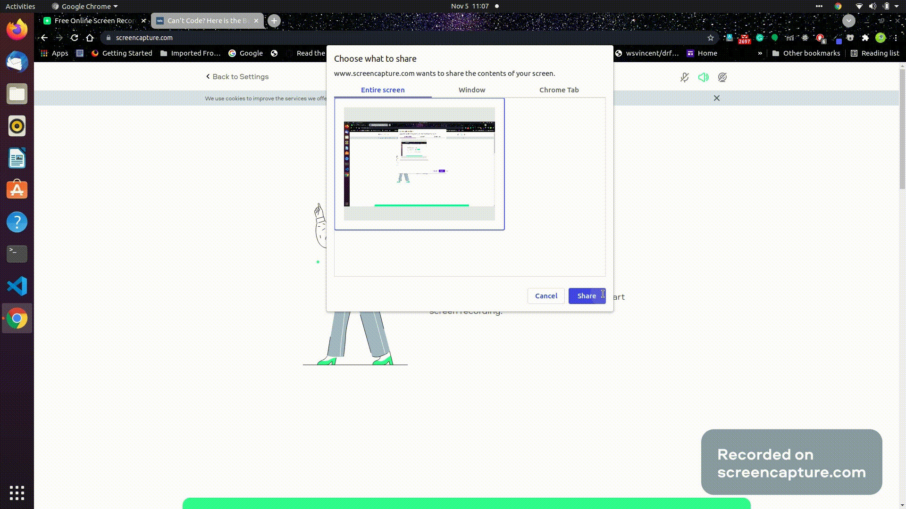

# Medium-Incognito - Chrome extension

## About

- You can open any locked medium article in incognito in just one click!

## How it Works

- Open any medium article, if it is locked then:

  - Click the extension button or
  - Press `Ctr+A` 

 it will open that article in incognito mode!

## How to install

1. Clone this repository.
2. Load your extension on Chrome following:
   1. Access `chrome://extensions/`
   2. Check `Developer mode`
   3. Click on `Load unpacked extension`
   4. Select the `Medium-Incognito` folder.
3. Happy hacking.

It will install the extension in your chrome browser.

## Resources
 - https://developer.chrome.com/docs/extensions/reference/tabs/
 

